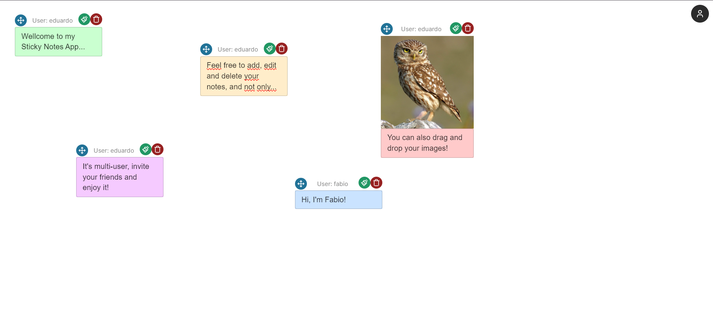
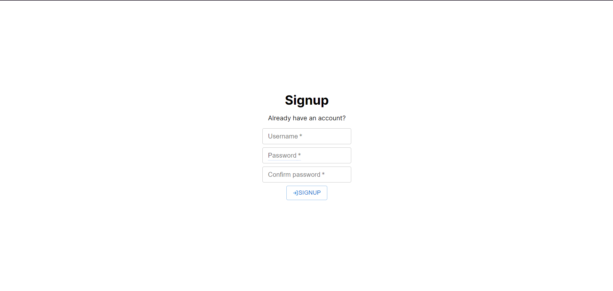

# Wellcome to my Sticky Notes App

Welcome to the Sticky Notes App project! This application is built using NodeJS with Express for the backend API, SQLite for the database, and ReactJS with Vite for the frontend. This is a multi-users app that allows users to create, edit, and delete sticky notes seamlessly.

## Project structure 
The project is structured into 2 main parts: the backend API and the frontend React application.

1. Backend (NodeJS + Express)
- The backend API is responsible for authenticate user (login or signup), handling data storage and retrieval. It exposes RESTful endpoints that the frontend can interact with to perform CRUD operations on sticky notes.
- The database is managed using SQLite, which is a lightweight and easy-to-use SQL database engine.
- Run on http://localhost:3000

2. Frontend (ReactJS + Vite)
- The frontend is built with ReactJS using Vite as the build tool. It communicates with the backend API to display and manage sticky notes.
- Users can login/signup and then create new sticky notes, edit existing ones, and delete notes they no longer need.
- Run on http://localhost:5173

## Features 
- User authentication; 
- Create, edit, delete and custom sticky note color;
- Drag and drop images.

## Technologies used 
- NodeJS: backend runtime environment for running JavaScript server-side;
- Express: web framework for NodeJS used to build the RESTful API;
- SQLite: lightweight SQL database engine used for data storage;
- ReactJS + Vite: JavaScript library and Build tool that provides a fast development environment for frontend projects.

## API endpoints 
- GET '/notes'
- POST '/notes'
- PUT '/notes:id'
- DELETE '/notes:id'
- POST '/auth/login'
- POST '/auth/signup'

# Getting started
1. Clone repository
``` bash
    git clone https://github.com/pazitto2208/StickyNotesApp.git
    cd StickyNotesApp 
```

2. Install dependencies
``` bash
    cd backend 
    npm install 
```

``` bash
    cd frontend
    npm install 
```

3. Start applications 
``` bash 
    cd backend
    npm start 
```

``` bash
    cd frontend
    npm run dev 
```

4. Access the Application 
Open your browser and visit http://localhost:5173 to view and interact with the Sticky Notes App.

# Enjoy it


You can signup/login and create your notes! 
user: eduardo
password: pass123

Feel free to explore, modify, and expand upon this project according to your needs and requirements.
